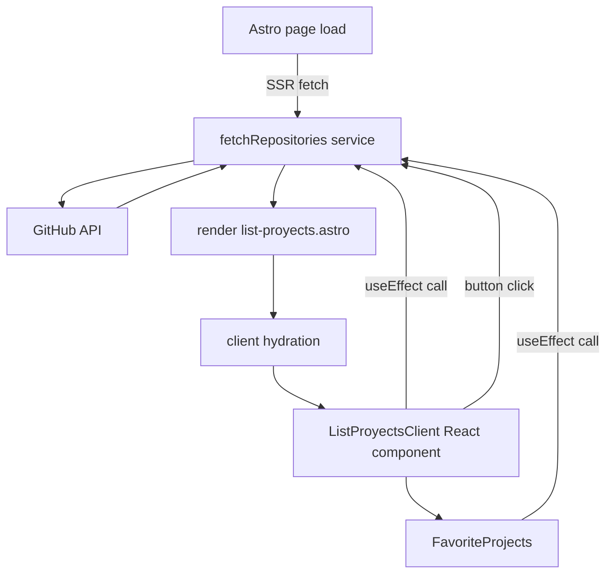

# Project Explanation

This document walks through every relevant file in the project, explaining its
purpose and the key lines of code. Diagrams illustrate how the pieces interact.

---

## astro.config.mjs

```js
// @ts-check
import { defineConfig } from "astro/config";

import tailwindcss from "@tailwindcss/vite";

import react from "@astrojs/react";
import tsconfigPaths from "vite-tsconfig-paths";

// https://astro.build/config
export default defineConfig({
    vite: {
        plugins: [
            tailwindcss(),
            tsconfigPaths(), // use TS path aliases
        ],
    },

    i18n: {
        locales: ["en", "es"],
        defaultLocale: "en",
        routing: { prefixDefaultLocale: false },
    },

    integrations: [react()],
});
```

- **Imports**: 3 plugins used by Vite: Tailwind, React support, and path alias
  resolution.
- **defineConfig**: exports Astro-specific configuration.
- **i18n**: defines locales and routing strategy.
- **plugins.each**: the order doesn't matter; `tsconfigPaths` ensures imports
  like `@components/...` resolve correctly.

---

## tsconfig.json

```json
{
  "extends": "astro/tsconfigs/strict",
  "compilerOptions": {
    "baseUrl": ".",
    "paths": {
      "@components/*": ["src/components/*"],
      "@layouts/*": ["src/layouts/*"],
      "@typings/*": ["src/types/*"],
      "@service/*": ["src/service/*"],
      "@shared/*": ["src/shared/*"]
    },
    "plugins": [{"name": "@astrojs/ts-plugin"}],
    "jsx": "react-jsx",
    "jsxImportSource": "react"
  }
}
```

- Using the strict Astro configuration as a base.
- `paths` maps for easier imports (`@typings` points at `src/types`).
- JSX settings for React.

---

## src/services/githubService.ts

```ts
import type { GitHubRepository } from "../types/Github";

// Helper function to handle potential errors
export function getErrorMessage(error: unknown): string {
  if (error instanceof Error) return error.message;
  return "Unknown error occurred";
}

function makeGitHubHeaders(): Record<string, string> {
  let token: string | undefined;
  if (typeof process !== 'undefined' && process.env.GITHUB_TOKEN) {
    token = process.env.GITHUB_TOKEN;
  }
  if (typeof import.meta !== 'undefined' && import.meta.env) {
    token =
      token ||
      (import.meta.env.GITHUB_TOKEN as string) ||
      (import.meta.env.VITE_GITHUB_TOKEN as string);
  }
  return token ? { Authorization: `token ${token}` } : {};
}

export const fetchRepositories = async (username: string): Promise<GitHubRepository[] | Error> => {
  try {
    const url = `https://api.github.com/users/${username}/repos`;
    const response = await fetch(url, { headers: makeGitHubHeaders() });
    if (!response.ok) {
      let msg = `GitHub API responded with status: ${response.status}`;
      if (response.status === 403) {
        try {
          const body = await response.json();
          msg += ` – ${body?.message || 'forbidden'}`;
        } catch {}
      }
      throw new Error(msg);
    }
    const data: Array<GitHubRepository> = await response.json();
    return data;
  } catch (error) {
    return new Error(getErrorMessage(error));
  }
};

export const fetchRepositoryLanguages = async (
  username: string,
  repo: string
): Promise<Record<string, number> | Error> => {
  try {
    const url = `https://api.github.com/repos/${username}/${repo}/languages`;
    const response = await fetch(url, { headers: makeGitHubHeaders() });
    if (!response.ok) {
      let msg = `GitHub API responded with status: ${response.status}`;
      if (response.status === 403) {
        try {
          const body = await response.json();
          msg += ` – ${body?.message || 'forbidden'}`;
        } catch {}
      }
      throw new Error(msg);
    }
    const data: Record<string, number> = await response.json();
    return data;
  } catch (error) {
    return new Error(getErrorMessage(error));
  }
};
```

- `makeGitHubHeaders` reads token from `process.env` (server) or `import.meta.env`
  (client, prefixed with `VITE_`).
- `fetchRepositories` and `fetchRepositoryLanguages` wrap `fetch` with error
  handling and token injection.
- Rate-limit message appended for 403 responses.

---

## src/types/Github.d.ts

```ts
export interface GitHubRepository {
    id: number;
    name: string;
    description: string | null;
    stargazers_count: number;
    html_url: string;
}

export interface RepositoryName{
    name: string
}
```

- Basic typings for GitHub API responses.

---

## src/components/cells/FavoriteProjects.tsx

```tsx
import ProjectCard from '@components/atoms/cards/ProjectCard';
import type { GitHubRepository } from '@typings/Github';
import React, { useEffect, useState } from 'react'

interface FavoriteProjectsProps {
    favoriteNames?: string[];
}

export const FavoriteProjects = ({ favoriteNames }: FavoriteProjectsProps) => {
    const [repos, setRepos] = useState<GitHubRepository[]>([]);

    useEffect(() => {
        const loadRepos = async () => {
            const result = await fetchRepositories("Cesar-Plyed");
            if (result instanceof Error) {
                console.error("Error al obtener repositorios:", result);
                setRepos([]);
            } else {
                setRepos(result);
            }
        };
        loadRepos();
        const handler = (e: any) => {
            if (e?.detail) {
                setRepos(Array.isArray(e.detail) ? e.detail : []);
            }
        };
        window.addEventListener('repos-updated', handler as EventListener);
        return () => window.removeEventListener('repos-updated', handler as EventListener);
    }, []);

    const filtered = favoriteNames && favoriteNames.length > 0
        ? repos.filter(r =>
            favoriteNames.some(fn => fn.toLowerCase() === r.name.toLowerCase())
        )
        : repos;

    if (filtered.length === 0) {
        return <p className="text-sm text-(--color-neutral-600) dark:text-(--color-neutral-400)">No favorites yet.</p>;
    }

    return (
        <div className="w-full h-54 grid grid-cols-1 gap-6 md:grid-cols-2 lg:grid-cols-3 ">
            {filtered.map((repo) => (
                <div key={repo.id}>
                    <ProjectCard repo={repo} />
                </div>
            ))}
        </div>
    );
};
```

- Fetches repositories on mount.
- Listens for `repos-updated` custom event to refresh.
- Filters by `favoriteNames` prop, case-insensitively.
- Renders nothing special if empty.

---

## src/components/atoms/buttons/UpdateRepositoryes.tsx

```tsx
import { type ButtonHTMLAttributes, type AnchorHTMLAttributes, type ReactNode, useState } from 'react';
import SecondaryButton from './SecondaryButton';
import { fetchRepositories } from 'src/services/githubService';

// …props types omitted for brevity

export default function UpdateRepository({ … }) {
  const [loading, setLoading] = useState(false);

  const handleClick = async (e: any) => {
    try {
      setLoading(true);
      const repos = await fetchRepositories('Cesar-Plyed');
      try {
        window.dispatchEvent(new CustomEvent('repos-updated', { detail: repos }));
      } catch (err) {
        // ignore
      }
    } catch (err) {
      console.error('Failed to fetch repositories', err);
    } finally {
      setLoading(false);
    }
  };

  return (
    <SecondaryButton … onClick={handleClick}>…</SecondaryButton>
  );
}
```

- Button that manually triggers a repo refresh.
- Uses same `repos-updated` event to notify listeners.

---

## src/components/atoms/cards/ProjectCard.tsx

```tsx
import { useEffect, useState } from "react";
import { Star, ExternalLink } from "lucide-react";
import type { GitHubRepository } from "../../../types/Github";
// … other imports …

interface ProjectCardProps { repo: GitHubRepository; }

export default function ProjectCard({ repo }: ProjectCardProps) {

    const [languages, setLanguages] = useState<Record<string, number>>({});

    useEffect(() => {
        async function loadLanguages() {
            const data = await fetchRepositoryLanguages("Cesar-Plyed", repo.name);
            if (!(data instanceof Error)) {
                setLanguages(data);
            }
        }
        loadLanguages();
    }, [repo.name]);

    // render-star count, language icons, links etc.
}
```

- Fetches language statistics for each repo on mount.
- Displays star count and icons for detected languages.

---

## src/pages/[lang]/index.astro

Frontmatter handles i18n and passes values to layout. The template renders
`<FavoriteProjects />` and `<ListProyects />` components. Client hydration is
controlled via `client:load` so that `useEffect` hooks run.

```astro
<FavoriteProjects client:load favoriteNames={["XDJA", "ExploteFuit"]} />
```

- The `favoriteNames` prop demonstrates passing an array from Astro to React.

---

## src/pages/[lang]/[repo]/index.astro

Renders a details page for a given repository. Uses `getStaticPaths` to
pre-generate pages for all repos fetched at build time.

```ts
export async function getStaticPaths() {
    const repos = await fetchRepositories("Cesar-Plyed");
    if (repos instanceof Error) return [];
    const langs = ["en-GB", "es-MX"];
    return langs.flatMap((lang) =>
        repos.map((repo) => ({ params: { lang, repo: repo.name }, props: { repo } }))
    );
}
```

- The page props include the repository data used to render description/stars.

---

## src/pages/list-proyects.astro

Server-rendered component that fetches repos at build time and displays
`<ListProyectsClient />` for client interactivity. Also includes an `UpdateRepositoryes`
button.

---

## Flow Diagram



- Server-side `fetchRepositories` runs once during build/SSR.
- Client components also call the same service via `fetch`.
- The update button triggers events to refresh state across components.

---

## Environment and Tokens

`.env` contains `GITHUB_TOKEN`. The service helper picks this up in both
server and (optionally) client contexts. If client-side requests are used,
`VITE_GITHUB_TOKEN` must be set too.

---

This file aims to demystify the architecture: Astro handles routing and
static rendering, React provides dynamic behaviour, and a tiny service module
wraps GitHub API calls with token management.
